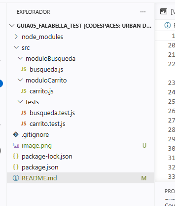
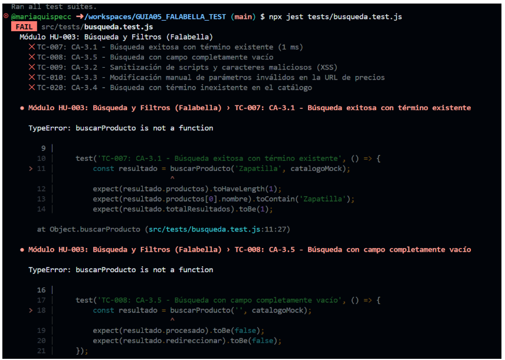
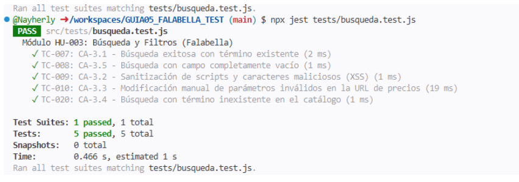

# GUIA05_FALABELLA_TEST
UNIVERSIDAD NACIONAL DE SAN CRISTÓBAL DE HUAMANGA

FACULTAD DE INGENIERÍA DE MINAS, GEOLOGÍA Y CIVIL

ESCUELA PROFESIONAL DE INGENIERÍA DE SISTEMAS

Asignatura : Pruebas y Aseguramiento de la Calidad de Software

Docente : Ing. LIZBETH JAICO QUISPE

Estudiantes:
- QUISPE CCAHUANA, María Leonela
- VILA CAYO, Nayherly Dianeth
  
URL Informe: https://docs.google.com/document/d/1YagJNK70kby4h4L07JTCtNyY2aBHeJ5ZaewM-9tOMao/edit?tab=t.0
JIRA: https://unsch-team-maria.atlassian.net/jira/plans/1/scenarios/1/timeline?vid=4&isPlanShare=true&atlOrigin=eyJpIjoiMjkxMDVjMWQ0NWNiNGY1N2I5YmU4ZDNhY2MzM2QxZWIiLCJwIjoiaiJ9&authuser=0

## ESTRUCTURA DE TRAZABILIDAD

## PRUEBAS UNITARIAS AUTOMATIZADAS 
#FASE RED 
Siguiend la metodología TDD, primero se define  los archivos de pruebas tests/busqueda.test.js. y tests/carrito.test.js. y Al ejecutarse inicialmente con npm test o npx jest, estos archivos fallarán (RED) debido a la ausencia de lógica implementada.

#FASE GREEN
Para resolver las aserciones anteriores y lograr el estado GREEN (todas las pruebas pasan), se desarrolla la lógica de negocio modular en la carpeta src/.

#FASE REFACTOR

